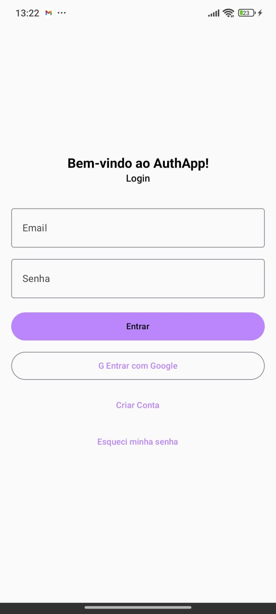
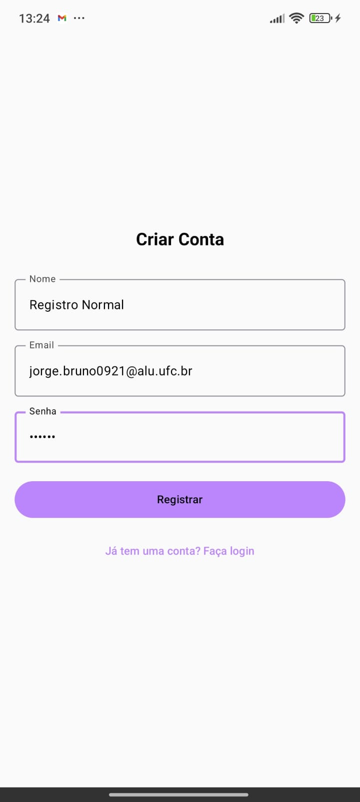
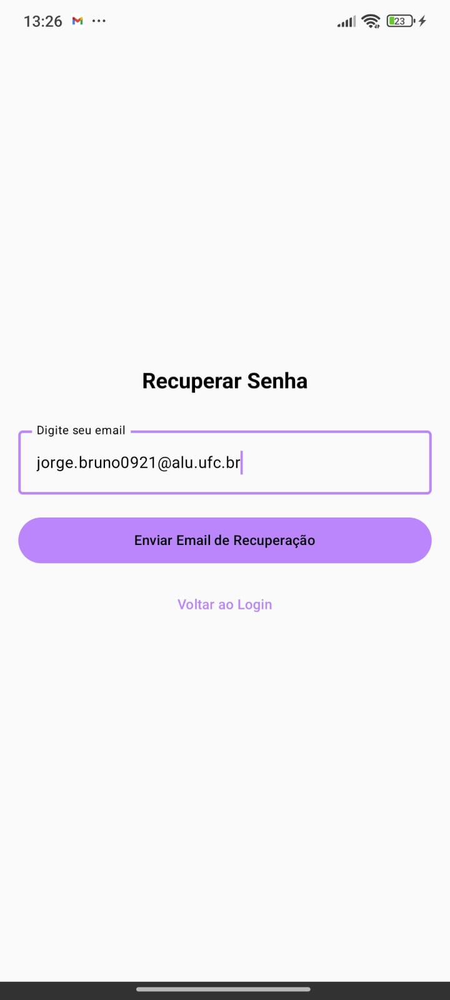
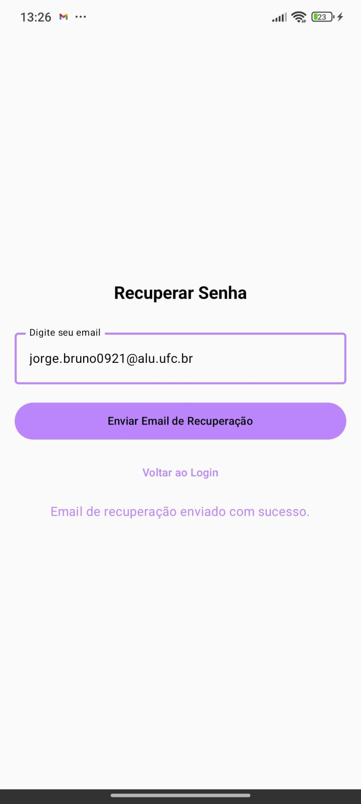
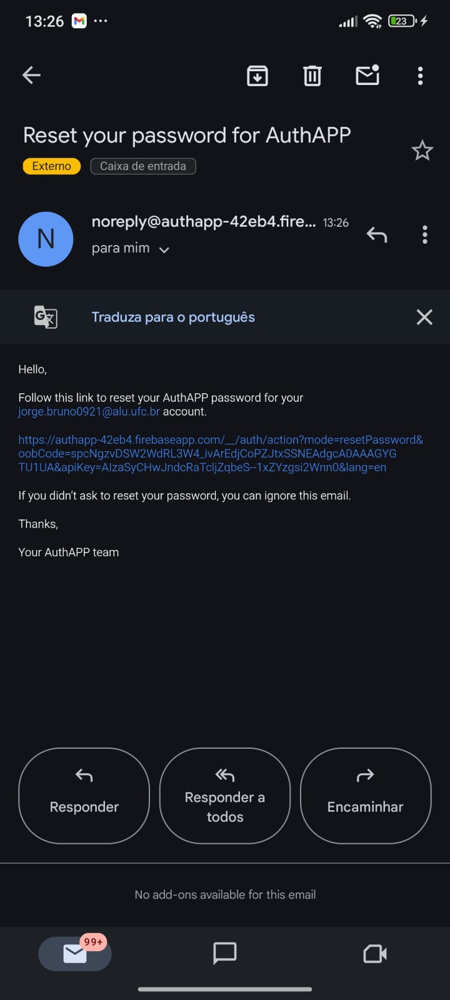
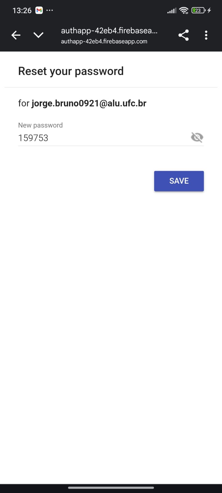
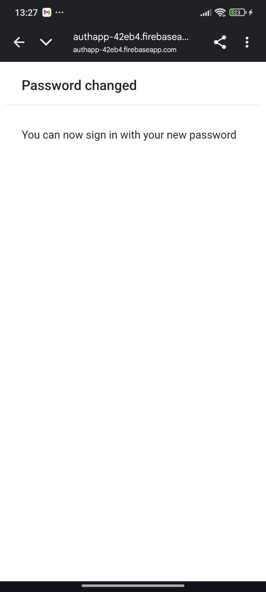

# AuthApp

O projeto "AuthApp" é um aplicativo Android que usa a arquitetura **MVVM (Model-View-ViewModel)** e a interface do usuário com **Jetpack Compose**. Ele gerencia o fluxo de autenticação de usuários, incluindo login, registro, recuperação de senha e logout.

## Funcionalidades
- **Login:** Com e-mail/senha e também com conta Google.
- **Registro de Usuário:** Criação de novas contas com e-mail, senha e nome.
- **Recuperação de Senha:** Fluxo completo de recuperação via e-mail.
- **Gerenciamento de Conta:** Exibição do nome de usuário na tela inicial e opção de logout.

## APK
https://drive.google.com/file/d/1UWk_NdPZRbD5yn7_jAufHEesKlbWdPtE/view?usp=sharing

## Screenshots

## Tela inicial
- 
## Tela de registro normal
- 
## Tela de logado (Conta normal)
- 
## Logar com Google
- 
## Tela de logado (Google)
- 
## Tela de recuperação
- 
## Tela de recuperação (E-mail de recuperação enviado)
- 
## E-mail de recuperação
- 
## Preencher nova senha
- 
## Senha Alterada
- 
## Firebase
- 