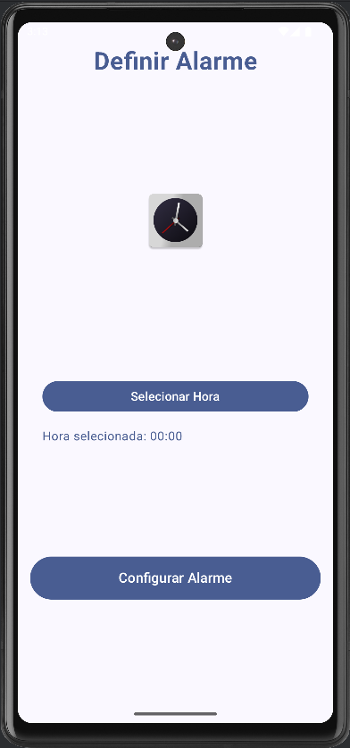
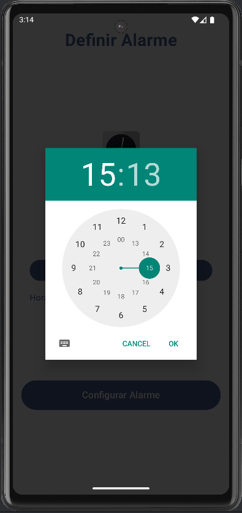
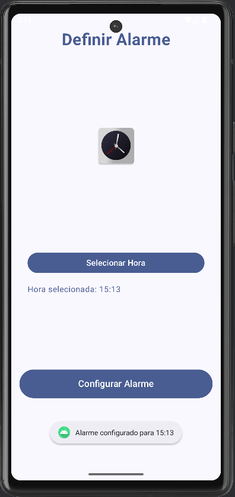

# AlarmApp

Aplicativo Android criado com **Jetpack Compose** que configura alarmes

## Funcionalidades

- **Botão** para adicionar alarmes.
- **Botão** para configurar o alarme.
- notificações de alarmes disparados.

## Screenshots

- 
- 
- 
- 
