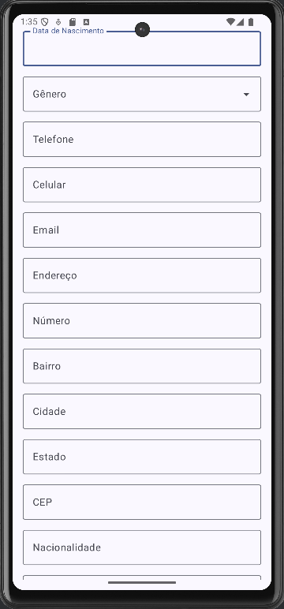
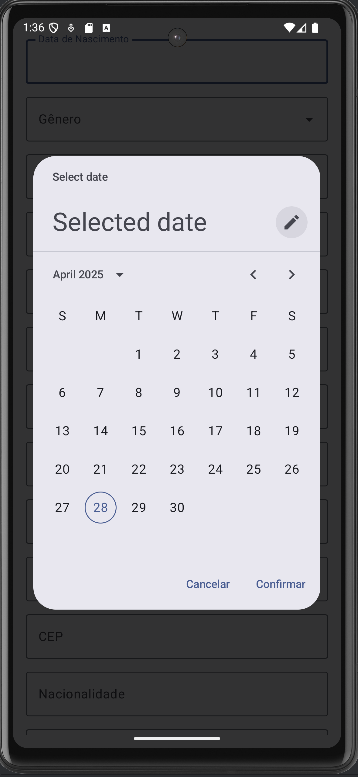
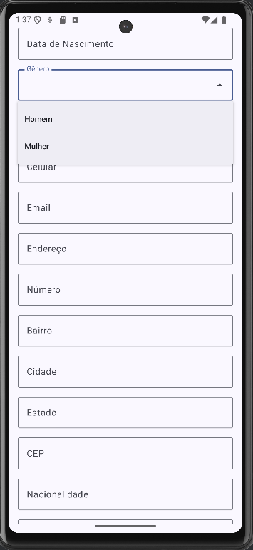

# CadApp

Aplicativo Android criado com **Jetpack Compose** que exibe um **formulário** para preenchimento de dados pessoais.

## Funcionalidades

- Campos de texto para informações como nome, sobrenome, telefone, endereço, etc.
- Seletor de **data de nascimento**.
- **Dropdown** para escolha do gênero.
- Botões para **enviar** e **limpar** os dados.

## Screenshots

- 
- 
- 
